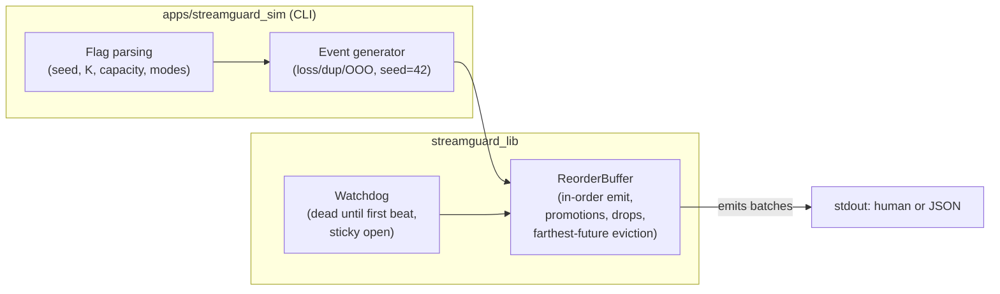
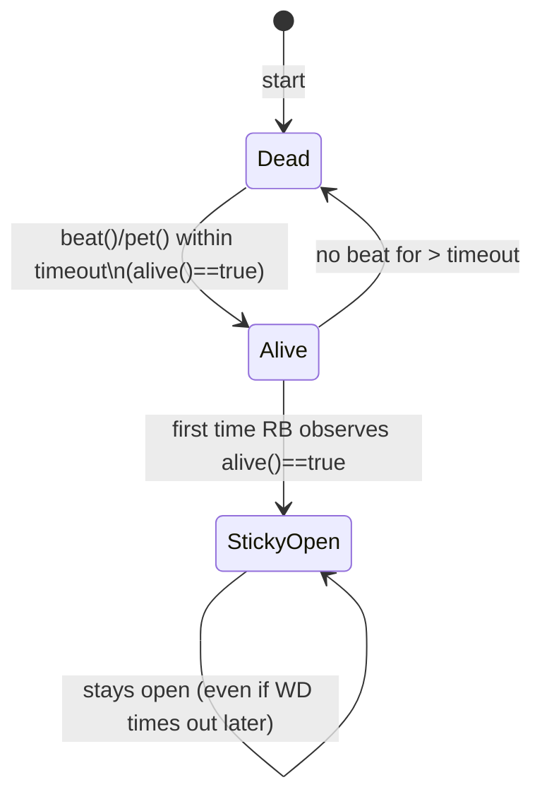

# StreamGuard

StreamGuard is a small, deterministic C++20 library for reordering out-of-order streams. It ships with a watchdog gate, a bounded reorder buffer, and a simulator CLI for reproducible experiments.

---

## Build & Test

### Windows (MSVC)

```powershell
cmake -S . -B build -G "Visual Studio 17 2022" -A x64 -DCMAKE_BUILD_TYPE=Debug
cmake --build build --config Debug --parallel
ctest --test-dir build -C Debug --output-on-failure -j 4
```

### Ubuntu (gcc/clang)

```bash
cmake -S . -B build -DCMAKE_BUILD_TYPE=Debug
cmake --build build -j
ctest --test-dir build -C Debug --output-on-failure -j 4
```

GoogleTest v1.14.0 is fetched automatically via `FetchContent`; no manual setup is required.

---

## Simulator CLI

The CLI exercises the reorder buffer with a deterministic RNG. A couple of quick runs:


## Design at a glance

> These diagrams render on GitHub via its built-in Mermaid support -- no extra tools needed.

### Architecture 


### Watchdog lifecycle (sticky gate)


### Emit & promotion flow
```mermaid
flowchart TD
  Start([try_emit])
  Gate{Watchdog set<br/>and gate closed?}
  Gate -->|yes and not alive()| Stop[return empty]
  Gate -->|yes and alive()| Open[open gate (sticky)]
  Gate -->|no| Scan

  Open --> Scan
  Scan{pending has<br/>next_expected?}
  Scan -->|yes| Emit[emit next_expected;<br/>advance next_expected] --> Scan
  Scan -->|no| Promote{at least missing_k<br/>newer buffered?}
  Promote -->|yes| Bump[record promoted;<br/>advance counters] --> Scan
  Promote -->|no| Stop[return batch]
```

### Capacity (bounded) rule of thumb
```mermaid
flowchart TD
  Push[push(seq)]
  TooOld{seq < next_expected?}
  Promoted{was promoted?}
  Dup{already in pending?}
  Overfull{pending.size > capacity?}
  Evict{farthest in pending U {seq}?}
  Frontier{seq == next_expected?}

  Push --> TooOld
  TooOld -->|yes| Promoted
  Promoted -->|yes| MKDrop[inc missing_k_dropped; drop] --> End
  Promoted -->|no| TooOldDrop[inc dropped_too_old; drop] --> End
  TooOld -->|no| Dup
  Dup -->|yes| DupDrop[inc dropped_duplicate; drop] --> End
  Dup -->|no| Overfull
  Overfull -->|no| End
  Overfull -->|yes| Frontier
  Frontier -->|yes| End[keep seq; try_emit will consume]
  Frontier -->|no| Evict
  Evict -->|seq is farthest| EvictNew[inc evicted; drop new] --> End
  Evict -->|pending has farthest| EvictOld[inc evicted; drop farthest pending] --> End
```

### CI overview (on every push)
```mermaid
flowchart LR
  A[Checkout] --> B[Configure (CMake Debug)]
  B --> C[Build: lib + tests + CLI]
  C --> D[ctest]
  D --> E1[CLI: single --json]
  D --> E2[CLI: multi --json]
  E1 --> F[done]
  E2 --> F
```

### Flags

```
--count <N>             how many unique ids to generate (1..N)
--loss-rate <0..1>      probability that a generated id is dropped before push
--dup-rate <0..1>       duplicate probability (duplicates reuse the same sequence id)
--ooo-rate <0..1>       simple adjacent swap probability for out-of-order arrival
--seed <int>            RNG seed (deterministic)
--capacity <N>          reorder-buffer capacity
--missing-k <K>         promote a frontier gap after K newer arrivals are pending
--hb-timeout-ms <ms>    watchdog timeout (sim beats at t=0)
--threads single|multi  choose deterministic single-thread or SPSC multi-thread
--verbose               print additional human-readable details
--json                  emit a JSON summary
--help                  print the option list
```

### Counters at a Glance

- `received` / `emitted` - total pushes observed and in-order items emitted.
- `dropped_duplicate` - same sequence enqueued more than once before emit.
- `dropped_too_old` - arrivals older than the current frontier that were never promoted.
- `missing_k_promotions` - how many times the frontier advanced because >=K newer items were waiting.
- `missing_k_dropped` - promoted sequences that later arrived (counted as late drops).
- `evicted` - items evicted under capacity pressure (either the candidate or an existing far-future entry).

---

## Continuous Integration

The GitHub Actions workflow builds and tests on both Windows and Ubuntu. Each job performs:

1. CMake configure (Debug)
2. Parallel build of all targets
3. `ctest` with failure output enabled
4. Simulator smoke runs (JSON output on both OSes, including multi-thread coverage)

---

## Determinism Notes

- The watchdog uses an injectable clock for unit tests; the simulator beats at t=0 and never sleeps.
- All randomness is derived from `std::mt19937` with an explicit seed (default 42).
- The multi-thread simulator path relies on a single-producer/single-consumer queue with condition variables to ensure deterministic ordering.