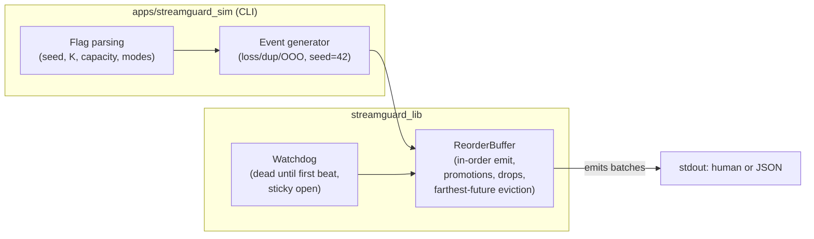
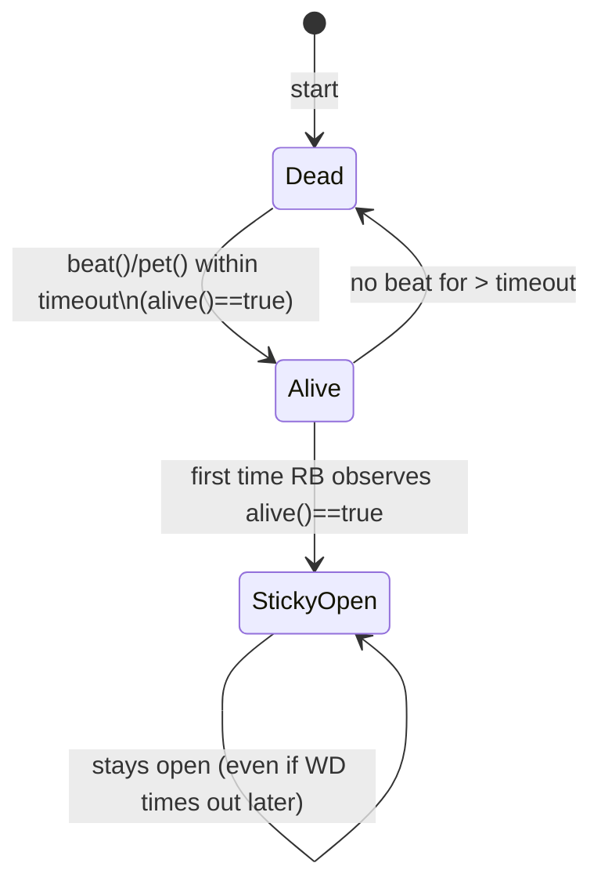

# StreamGuard

StreamGuard is a small, deterministic C++20 library for reordering out-of-order streams. It ships with a watchdog gate, a bounded reorder buffer, and a simulator CLI for reproducible experiments.

---

## Build & Test

### Windows (MSVC)

```powershell
cmake -S . -B build -G "Visual Studio 17 2022" -A x64 -DCMAKE_BUILD_TYPE=Debug
cmake --build build --config Debug --parallel
ctest --test-dir build -C Debug --output-on-failure -j 4
```

### Ubuntu (gcc/clang)

```bash
cmake -S . -B build -DCMAKE_BUILD_TYPE=Debug
cmake --build build -j
ctest --test-dir build -C Debug --output-on-failure -j 4
```

GoogleTest v1.14.0 is fetched automatically via `FetchContent`; no manual setup is required.

---

## Simulator CLI
The CLI exercises the reorder buffer with a deterministic RNG (default seed = 42).
Below are step-by-step instructions to build and run it on Windows and Ubuntu.

### 1) Build the project

**Windows (MSVC):**
```powershell
# From repo root
cmake -S . -B build -G "Visual Studio 17 2022" -A x64 -DCMAKE_BUILD_TYPE=Debug
cmake --build build --config Debug --parallel
Ubuntu (gcc/clang):

Ubuntu (gcc/clang):
```bash
# From repo root
cmake -S . -B build -DCMAKE_BUILD_TYPE=Debug
cmake --build build -j


2) Run the simulator
Summary (single thread):
powershell
# Windows
./build/Debug/streamguard_sim.exe --count 50 --seed 42

bash
# Ubuntu
./build/streamguard_sim --count 50 --seed 42

JSON summary:
powershell
# Windows
./build/Debug/streamguard_sim.exe --count 50 --seed 42 --json

bash
# Ubuntu
./build/streamguard_sim --count 50 --seed 42 --json
Multi-thread mode (deterministic SPSC queue):

Multi-thread mode (deterministic SPSC):
powershell
# Windows
./build/Debug/streamguard_sim.exe --count 50 --seed 42 --threads multi --json
bash
# Ubuntu
./build/streamguard_sim --count 50 --seed 42 --threads multi --json


Common flags
--count <N>: generate IDs 1..N

--seed <int>: RNG seed (reproducible runs)

--capacity <N>: buffer capacity (bounded)

--missing-k <K>: promote frontier after K newer arrivals

--loss-rate <0..1>: drop some generated IDs

--dup-rate <0..1>: duplicate some IDs (by seq)

--ooo-rate <0..1>: introduce simple out-of-order swaps

--hb-timeout-ms <ms>: watchdog timeout (we beat at t=0)

--threads single|multi: execution mode (both deterministic)

--json: print JSON instead of a human line

--help: show usage

Tip: Runs are deterministic by design. Re-use the same --seed to reproduce results byte-for-byte.


## Design 

> These diagrams render on GitHub via its built-in Mermaid support -- no extra tools needed.

### Architecture 


### Watchdog lifecycle 


### Emit & promotion flow
```mermaid
flowchart TD

  Start([try_emit])
  GateWD{watchdog set?}
  AliveQ{alive?}
  Scan{has next_expected}
  Emit[emit and advance]
  PromoteQ{promote possible?}
  Bump[promote; advance]
  StopEmpty[return empty]
  StopBatch[return batch]

  Start --> GateWD
  GateWD --> Scan
  GateWD --> AliveQ
  AliveQ --> StopEmpty
  AliveQ --> Scan
  Scan --> Emit
  Emit --> Scan
  Scan --> PromoteQ
  PromoteQ --> StopBatch
  PromoteQ --> Bump
  Bump --> Scan


### Capacity 
```mermaid
flowchart TD

  Push[push(seq)]
  TooOld{seq < next_expected}
  WasPromoted{was promoted}
  IsDup{already in pending}
  Overfull{pending.size > capacity}
  Frontier{seq == next_expected}
  EvictQ{farthest element}
  End[done]

  Push --> TooOld
  TooOld --> WasPromoted
  WasPromoted --> End
  TooOld --> IsDup
  IsDup --> End
  IsDup --> Overfull
  Overfull --> End
  Overfull --> Frontier
  Frontier --> End
  Overfull --> EvictQ
  EvictQ --> End


### CI overview 
```mermaid
flowchart LR

  A[Checkout] --> B[Configure Debug]
  B --> C[Build: lib + tests + CLI]
  C --> D[ctest]
  D --> E1[CLI single --json]
  D --> E2[CLI multi --json]
  E1 --> F[done]
  E2 --> F


### Flags

```
--count <N>             how many unique ids to generate (1..N)
--loss-rate <0..1>      probability that a generated id is dropped before push
--dup-rate <0..1>       duplicate probability (duplicates reuse the same sequence id)
--ooo-rate <0..1>       simple adjacent swap probability for out-of-order arrival
--seed <int>            RNG seed (deterministic)
--capacity <N>          reorder-buffer capacity
--missing-k <K>         promote a frontier gap after K newer arrivals are pending
--hb-timeout-ms <ms>    watchdog timeout (sim beats at t=0)
--threads single|multi  choose deterministic single-thread or SPSC multi-thread
--verbose               print additional human-readable details
--json                  emit a JSON summary
--help                  print the option list
```

### Counters 

- `received` / `emitted` - total pushes observed and in-order items emitted.
- `dropped_duplicate` - same sequence enqueued more than once before emit.
- `dropped_too_old` - arrivals older than the current frontier that were never promoted.
- `missing_k_promotions` - how many times the frontier advanced because >=K newer items were waiting.
- `missing_k_dropped` - promoted sequences that later arrived (counted as late drops).
- `evicted` - items evicted under capacity pressure (either the candidate or an existing far-future entry).

---

## Continuous Integration

The GitHub Actions workflow builds and tests on both Windows and Ubuntu. Each job performs:

1. CMake configure (Debug)
2. Parallel build of all targets
3. `ctest` with failure output enabled
4. Simulator smoke runs (JSON output on both OSes, including multi-thread coverage)

---

## Notes

- The watchdog uses an injectable clock for unit tests; the simulator beats at t=0 and never sleeps.
- All randomness is derived from `std::mt19937` with an explicit seed (default 42).
- The multi-thread simulator path relies on a single-producer/single-consumer queue with condition variables to ensure deterministic ordering.