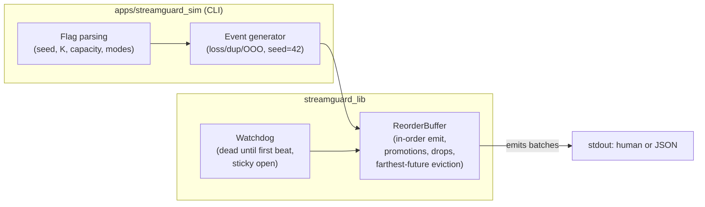
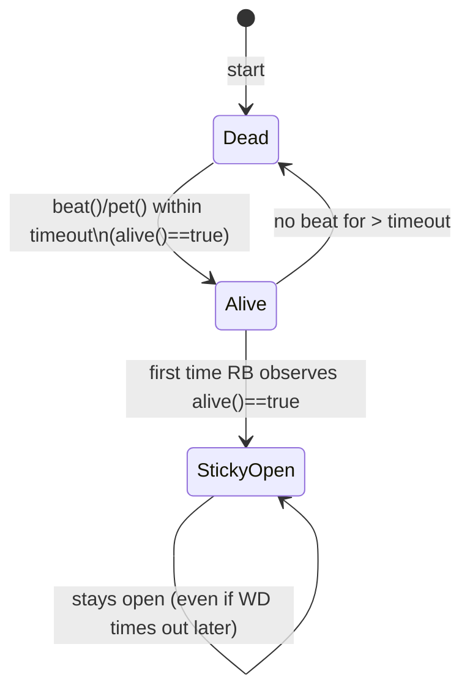

# StreamGuard Architecture

These GitHub-native Mermaid diagrams summarize the design. No external tools required.

## High-level


## Watchdog lifecycle


## Emit & promotion flow
```mermaid
flowchart TD

  Start([try_emit])
  GateWD{watchdog set?}
  AliveQ{alive?}
  Scan{has next_expected}
  Emit[emit and advance]
  PromoteQ{promote possible?}
  Bump[promote; advance]
  StopEmpty[return empty]
  StopBatch[return batch]

  Start --> GateWD
  GateWD --> Scan
  GateWD --> AliveQ
  AliveQ --> StopEmpty
  AliveQ --> Scan
  Scan --> Emit
  Emit --> Scan
  Scan --> PromoteQ
  PromoteQ --> StopBatch
  PromoteQ --> Bump
  Bump --> Scan


## Capacity (bounded)
```mermaid
fflowchart TD

  Push[push(seq)]
  TooOld{seq < next_expected}
  WasPromoted{was promoted}
  IsDup{already in pending}
  Overfull{pending.size > capacity}
  Frontier{seq == next_expected}
  EvictQ{farthest element}
  End[done]

  Push --> TooOld
  TooOld --> WasPromoted
  WasPromoted --> End
  TooOld --> IsDup
  IsDup --> End
  IsDup --> Overfull
  Overfull --> End
  Overfull --> Frontier
  Frontier --> End
  Overfull --> EvictQ
  EvictQ --> End


## CI & simulator path
```mermaid
flowchart LR

  A[Checkout] --> B[Configure Debug]
  B --> C[Build: lib + tests + CLI]
  C --> D[ctest]
  D --> E1[CLI single --json]
  D --> E2[CLI multi --json]
  E1 --> F[done]
  E2 --> F


## Simulator single vs multi
```mermaid
sequenceDiagram
  participant Gen as Generator (seed=42)
  participant Q as SPSC Queue (multi only)
  participant RB as ReorderBuffer
  participant WD as Watchdog

  Note over WD: beat() at t=0 -> sticky gate open
  Gen->>Gen: Make arrivals (loss/dup/OOO)
  alt single-thread
    Gen->>RB: push(seq)
    RB-->>RB: try_emit()
  else multi-thread
    Gen->>Q: enqueue(seq)
    Q->>RB: dequeue(seq) FIFO
    RB-->>RB: try_emit()
  end
  RB->>RB: update stats; emit batches
```