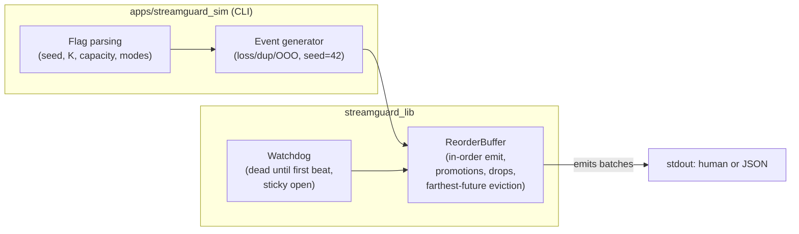
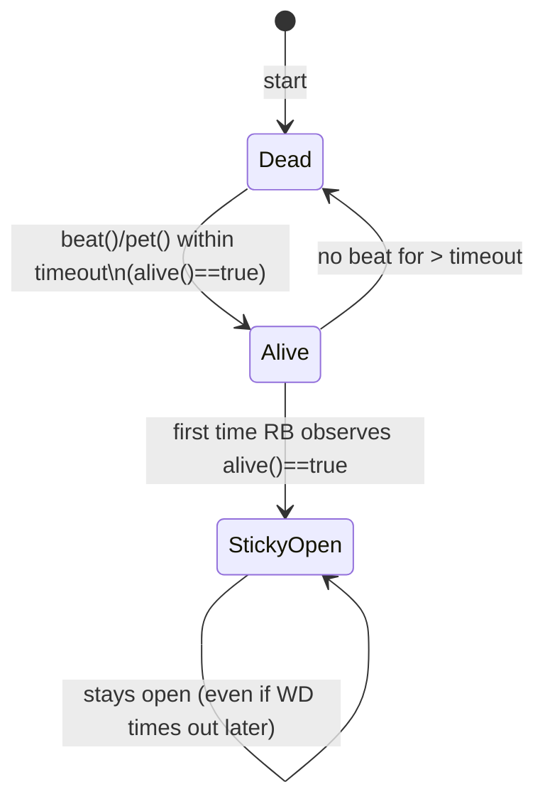

# StreamGuard Architecture

These GitHub-native Mermaid diagrams summarize the design. No external tools required.

## High-level


## Watchdog lifecycle


## Emit & promotion flow
```mermaid
flowchart TD
  Start([try_emit]);
  Gate{watchdog set?};
  Gate -->|no| Scan;
  Gate -->|yes| AliveQ{alive?};
  AliveQ -->|no| Stop[return empty];
  AliveQ -->|yes| Open[open gate (sticky)];
  Open --> Scan;
  Scan{pending has<br/>next_expected?};
  Scan -->|yes| Emit[emit next_expected;<br/>advance next_expected];
  Emit --> Scan;
  Scan -->|no| Promote{>= missing_k<br/>newer buffered?};
  Promote -->|no| Stop2[return batch];
  Promote -->|yes| Bump[record promotion;<br/>advance counters];
  Bump --> Scan;


## Capacity (bounded)
```mermaid
flowchart TD
  Push[push(seq)];
  TooOld{seq < next_expected?};
  Promoted{was promoted?};
  Dup{already in pending?};
  Overfull{pending.size > capacity?};
  Evict{farthest element?};
  Frontier{seq == next_expected?};

  Push --> TooOld;
  TooOld -->|yes| Promoted;
  Promoted -->|yes| MKDrop[inc missing_k_dropped; drop] --> End;
  Promoted -->|no| TooOldDrop[inc dropped_too_old; drop] --> End;
  TooOld -->|no| Dup;
  Dup -->|yes| DupDrop[inc dropped_duplicate; drop] --> End;
  Dup -->|no| Overfull;
  Overfull -->|no| End;
  Overfull -->|yes| Frontier;
  Frontier -->|yes| End[keep seq; try_emit will consume];
  Frontier -->|no| Evict;
  Evict -->|new is farthest| EvictNew[inc evicted; drop new] --> End;
  Evict -->|pending farthest| EvictOld[inc evicted; drop farthest pending] --> End;


## CI & simulator path
```mermaid
flowchart LR
  A[Checkout];
  B[Configure (CMake Debug)];
  C[Build: lib + tests + CLI];
  D[ctest];
  E1[CLI: single --json];
  E2[CLI: multi --json];
  F[done];

  A --> B;
  B --> C;
  C --> D;
  D --> E1;
  D --> E2;
  E1 --> F;
  E2 --> F;


## Simulator single vs multi
```mermaid
sequenceDiagram
  participant Gen as Generator (seed=42)
  participant Q as SPSC Queue (multi only)
  participant RB as ReorderBuffer
  participant WD as Watchdog

  Note over WD: beat() at t=0 -> sticky gate open
  Gen->>Gen: Make arrivals (loss/dup/OOO)
  alt single-thread
    Gen->>RB: push(seq)
    RB-->>RB: try_emit()
  else multi-thread
    Gen->>Q: enqueue(seq)
    Q->>RB: dequeue(seq) FIFO
    RB-->>RB: try_emit()
  end
  RB->>RB: update stats; emit batches
```